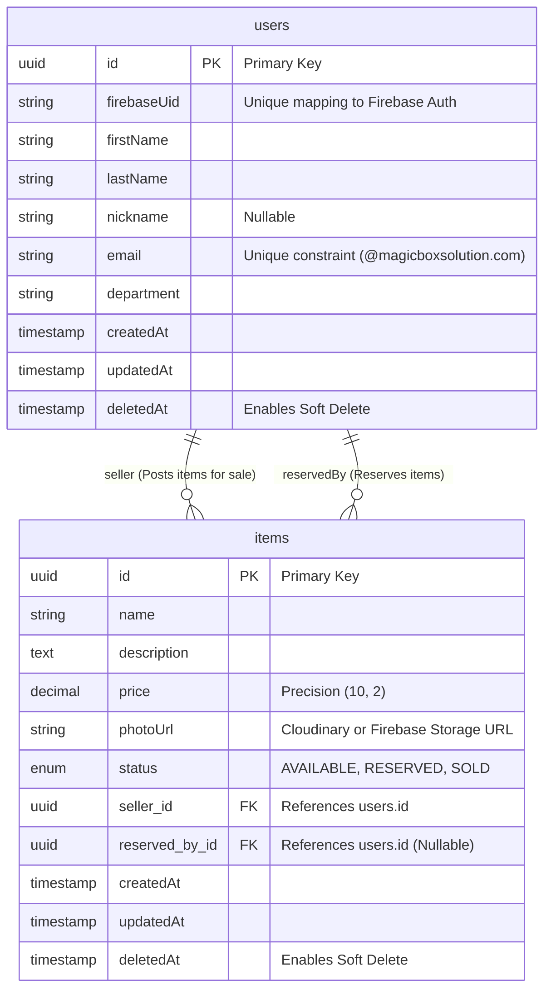

# MBS Talad Nut - Database Schema

```mermaid
erDiagram
    users {
        uuid id PK "Primary Key"
        string firebaseUid "Unique mapping to Firebase Auth"
        string firstName 
        string lastName 
        string nickname "Nullable"
        string email "Unique constraint (@magicboxsolution.com)"
        string department 
        timestamp createdAt 
        timestamp updatedAt 
        timestamp deletedAt "Enables Soft Delete"
    }

    items {
        uuid id PK "Primary Key"
        string name 
        text description 
        decimal price "Precision (10, 2)"
        string photoUrl "Cloudinary or Firebase Storage URL"
        enum status "AVAILABLE, RESERVED, SOLD"
        uuid seller_id FK "References users.id"
        uuid reserved_by_id FK "References users.id (Nullable)"
        timestamp createdAt 
        timestamp updatedAt 
        timestamp deletedAt "Enables Soft Delete"
    }

    %% Relationships
    users ||--o{ items : "seller (Posts items for sale)"
    users ||--o{ items : "reservedBy (Reserves items)"
```
